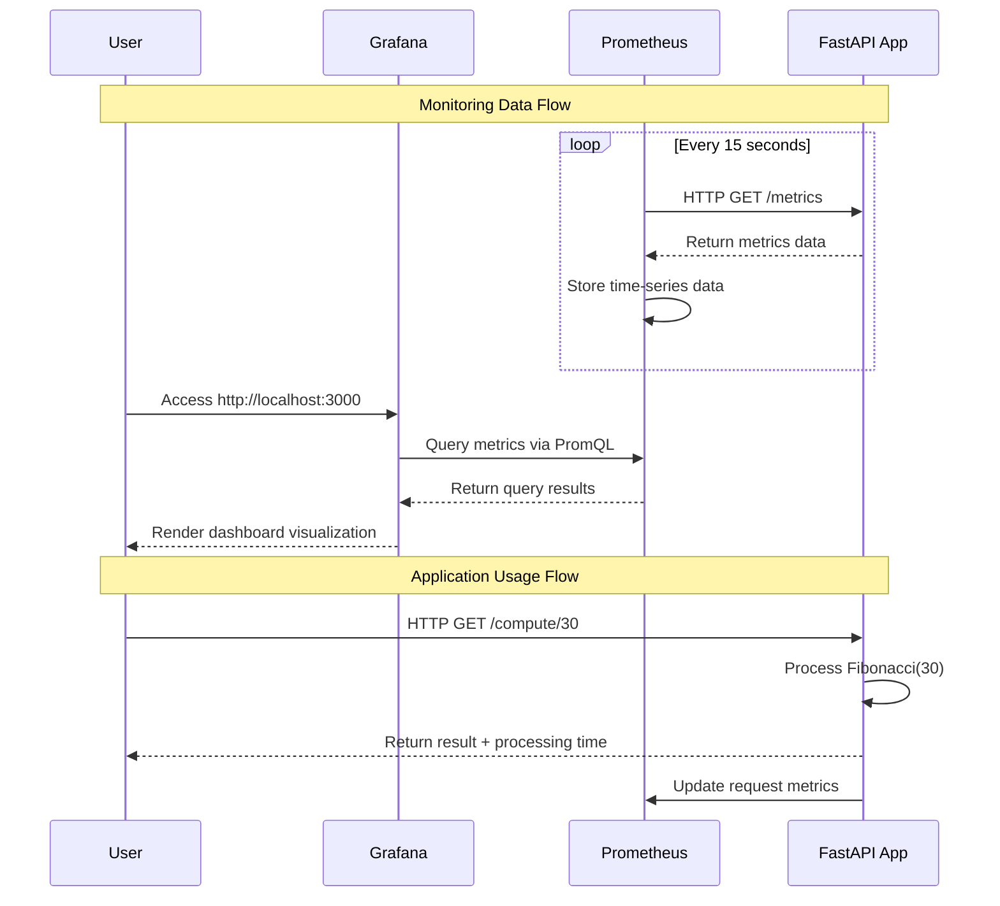
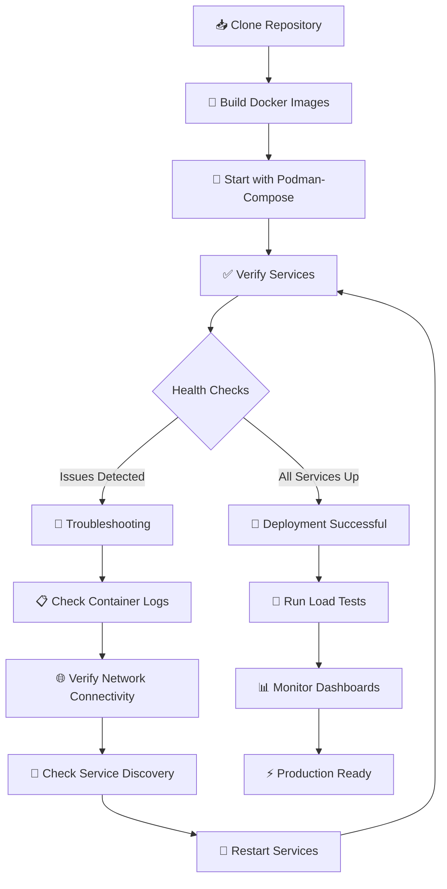

# Key Metrics Flow
```bash
FastAPI Business Logic
        ↓
HTTP Middleware (Instrumentation)
        ↓
/metrics endpoint (Prometheus format)
        ↓
Prometheus Scraper (15s intervals)
        ↓
Time Series Database (TSDB)
        ↓
Grafana Dashboards (PromQL queries)
        ↓
Developer Insights & Alerts
```
# Network Communication
```bash
Container Network (fastapi-apm-network)
    ├── fastapi-apm-app:8031    ←  Prometheus scrapes metrics
    ├── prometheus-monitoring:9090  ←  Grafana queries data  
    └── grafana-dashboard:3000   ←  User accesses dashboards

Host Machine Access
    ├── localhost:8031  (FastAPI API)
    ├── localhost:9090  (Prometheus UI)
    └── localhost:3000  (Grafana Dashboards)
```


# 🚀 FastAPI APM Monitoring Stack - Infrastructure Knowledge Transfer

## 📋 Table of Contents
- [Architecture Overview](#architecture-overview)
- [Component Details](#component-details)
- [Data Flow](#data-flow)
- [Deployment Workflow](#deployment-workflow)
- [Troubleshooting Guide](#troubleshooting-guide)

## 🏗️ Architecture Overview

```mermaid
graph TB
    subgraph "Application Layer"
        A[FastAPI App<br/>Port 8031]
        A --> A1[📊 /metrics endpoint]
        A --> A2[❤️ /health endpoint]
        A --> A3[⚡ /compute/{n} endpoint]
    end

    subgraph "Monitoring Stack"
        B[Prometheus<br/>Port 9090]
        C[Grafana<br/>Port 3000]
        D[Alert Manager<br/>Optional]
    end

    subgraph "External Access"
        E[User/Developer<br/>Browser/API Client]
        F[Load Testing Tools<br/>hey, k6, wrk]
    end

    %% Data Flow
    A1 -- Metrics Scraping every 15s --> B
    B -- Query Data --> C
    E -- Access Dashboards --> C
    F -- Generate Load --> A
    E -- API Calls --> A

    %% Styling
    classDef app fill:#e1f5fe,stroke:#01579b,stroke-width:2px
    classDef monitor fill:#f3e5f5,stroke:#4a148c,stroke-width:2px
    classDef external fill:#e8f5e8,stroke:#1b5e20,stroke-width:2px
    
    class A,A1,A2,A3 app
    class B,C,D monitor
    class E,F external
```

## 🎯 System Components

### 🔵 **FastAPI Application** (`fastapi-apm-app`)
- **Port**: 8031
- **Purpose**: Main application with compute-intensive endpoints
- **Key Features**:
  - 🔄 REST API with Fibonacci computation
  - 📊 Prometheus metrics exposure
  - ❤️ Health check endpoints
  - 🐳 Containerized deployment

### 🔴 **Prometheus** (`prometheus-monitoring`)
- **Port**: 9090
- **Purpose**: Time-series database and metrics collector
- **Key Features**:
  - ⏰ Scrapes metrics every 15 seconds
  - 📈 Stores time-series data
  - ⚠️ Alert rule evaluation
  - 🔍 Query language (PromQL)

### 🟢 **Grafana** (`grafana-dashboard`)
- **Port**: 3000
- **Purpose**: Visualization and dashboard platform
- **Key Features**:
  - 📊 Pre-configured dashboards
  - 🔗 Prometheus data source
  - 👥 Anonymous access enabled
  - ⚙️ Auto-provisioning

## 🔄 Data Flow Sequence



## 🛠️ Component Configuration Details

### 📝 **FastAPI Metrics Endpoints**
```python
# Key endpoints exposed
GET /health           # Service health check
GET /compute/{n}      # Heavy computation (O(2^n))
GET /metrics          # Prometheus metrics (auto-generated)
```

### ⚙️ **Prometheus Scraping Configuration**
```yaml
# prometheus.yml
scrape_configs:
  - job_name: 'fastapi-app'
    metrics_path: /metrics
    static_configs:
      - targets: ['fastapi-apm-app:8031']  # Docker service discovery
    scrape_interval: 15s
```

### 🎨 **Grafana Dashboard Setup**
```yaml
# datasources/prometheus.yaml
datasources:
  - name: Prometheus
    type: prometheus
    url: http://prometheus-monitoring:9090  # Internal Docker DNS
    isDefault: true
```

## 🚀 Deployment Workflow



### 🎯 **Deployment Commands**
```bash
# 1. Build and deploy
podman-compose up -d --build

# 2. Verify all services
curl http://localhost:8031/health      # FastAPI
curl http://localhost:9090/targets     # Prometheus
curl http://localhost:3000/api/health  # Grafana

# 3. Test computation endpoint
curl http://localhost:8031/compute/30

# 4. Generate load for testing
python tests/load_test.py --url http://localhost:8031/compute/30 --rps 100 --duration 60
```

## 🔍 Monitoring Metrics Overview

### 📊 **Key Performance Indicators (KPIs)**

| Metric | PromQL Query | Alert Threshold | Purpose |
|--------|-------------|-----------------|---------|
| **Request Rate** | `rate(http_requests_total[5m])` | N/A | Traffic volume monitoring |
| **Error Rate** | `rate(http_requests_total{status=~"5.."}[5m])` | > 1% | Service reliability |
| **Response Time** | `histogram_quantile(0.95, rate(http_request_duration_seconds_bucket[5m]))` | > 1s | User experience |
| **Service Uptime** | `up{job="fastapi-app"}` | == 0 | Service availability |

### 🎨 **Grafana Dashboard Panels**

```
FastAPI Monitoring Dashboard
├── 📈 Request Rate (RPS)
├── ❌ Error Rate (%)
├── ⏱️  Response Time (p95)
├── 💾 Memory Usage
├── 🔄 Active Requests
└── 📋 Endpoint Performance Table
```

## 🚨 Troubleshooting Guide

### 🔴 **Common Issues & Solutions**

| Symptom | Root Cause | Solution |
|---------|------------|----------|
| `connection refused` | Service not running | Check `podman ps` and restart |
| `no such host` | DNS resolution failed | Verify network and service names |
| `metrics not showing` | Scraping failed | Check Prometheus targets |
| `dashboard empty` | Data source issue | Verify Grafana-Prometheus connection |

### 🟡 **Diagnostic Commands**
```bash
# Container status
podman ps -a
podman logs <container_name>

# Network connectivity
podman exec <container> nslookup <service>
podman exec <container> curl -v http://service:port

# Prometheus targets
curl http://localhost:9090/api/v1/targets

# Application metrics
curl http://localhost:8031/metrics | grep http_requests
```

### 🟢 **Health Check Endpoints**
- **FastAPI**: `http://localhost:8031/health`
- **Prometheus**: `http://localhost:9090/-/healthy`
- **Grafana**: `http://localhost:3000/api/health`

## 📈 Performance Characteristics

### ⚡ **Expected Performance**
- **FastAPI Response**: < 500ms for normal endpoints
- **Fibonacci(30)**: ~500ms processing time
- **Metrics Scraping**: < 100ms overhead
- **Dashboard Load**: < 2 seconds

### 🔄 **Load Testing Results**
| RPS (Requests/Second) | Avg Response Time | Error Rate | System Load |
|----------------------|-------------------|------------|-------------|
| 10 RPS | ~50ms | 0% | Low |
| 100 RPS | ~200ms | 0% | Medium |
| 500 RPS | ~800ms | <1% | High |
| 1000 RPS | >1500ms | >5% | Critical |

## 🎯 Key Benefits & Use Cases

### ✅ **Benefits**
- 🚀 **Real-time Monitoring**: Live metrics with 15-second granularity
- 📊 **Business Insights**: Track user-facing performance metrics
- 🔧 **Developer Friendly**: Easy to set up and maintain
- 💰 **Cost Effective**: Open-source stack with no licensing costs
- 🐳 **Container Native**: Designed for modern cloud deployments

### 🎯 **Use Cases**
1. **API Performance Monitoring** - Track latency and error rates
2. **Capacity Planning** - Understand system limits under load
3. **Incident Investigation** - Correlate metrics with application issues
4. **Development Testing** - Validate performance during feature development

---

## 📞 Support & Maintenance

### 🔧 **Regular Maintenance Tasks**
- ✅ Update container images quarterly
- ✅ Review and optimize alert thresholds
- ✅ Monitor disk space for time-series data
- ✅ Backup Grafana dashboards

### 🆘 **Getting Help**
1. Check container logs: `podman logs <container_name>`
2. Verify network: `podman network inspect monitoring`
3. Test endpoints individually
4. Review this KT document for common solutions

---

**Document Version**: 1.0  
**Last Updated**: 2024-12-19  
**Maintainer**: DevOps Team  
**Status**: ✅ Production Ready
